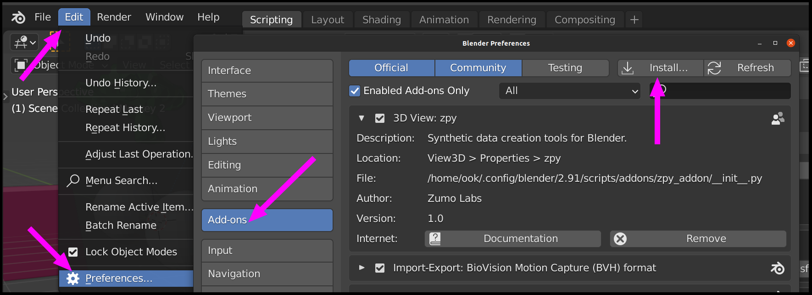

<div align="center">


**`zpy`: Synthetic data in Blender.**

<p align="center">
  <a href="https://zumolabs.ai/">Website</a> •
  <a href="#Install">Install</a> •
  <a href="#Examples">Examples</a> •
  <a href="#Contribute">Contribute</a> •
  <a href="#Licence">Licence</a>
</p>

[](https://pypi.org/project/zpy/)
[](https://badge.fury.io/py/zpy)
[](https://join.slack.com/t/pytorch-lightning/shared_invite/zt-f6bl2l0l-JYMK3tbAgAmGRrlNr00f1A)
[](https://github.com/ZumoLabs/zpy/blob/master/LICENSE)
</div>

## Abstract

Collecting, labeling, and cleaning data for computer vision is a pain. Jump into the future and create your own data instead! This synthetic data is faster to develop with, effectively infinite, and gives you full control to prevent bias and privacy issues from creeping in. We created `zpy` to make synthetic data easy, by simplifying the scene creation process and providing an easy way to generate synthetic data at scale.

## Install

### Install: Using Blender GUI

You can install the addon from within Blender itself. Navigate to "Edit -> Preferences -> Add-ons". You should be able to install and enable the addon from there there.



### Install: Using Install Script

``` 
$ /bin/bash -c "$(curl -fsSL https://raw.githubusercontent.com/ZumoLabs/zpy/main/install.sh?token=<token>)"
```

Set these environment variables for specific versions:

```
export BLENDER_VERSION="2.91"
export BLENDER_VERSION_FULL="2.91.0"
export ZPY_VERSION="v1.3.3"
```

### Install: Developer Environment (Linux)

```
export ZPY_SRC_PATH="$HOME/zumolabs/zpy"
export BLENDER_VERSION="2.91"
export BLENDER_VERSION_FULL="2.91.0"
export BLENDER_PATH="$HOME/Downloads/blender-${BLENDER_VERSION_FULL}-linux64/${BLENDER_VERSION}"
export BLENDER_LIB_PY="${BLENDER_PATH}/python/lib/python3.7"
export BLENDER_BIN_PY="${BLENDER_PATH}/python/bin/python3.7m"
export BLENDER_BIN_PIP="${BLENDER_PATH}/python/bin/pip3"
```

Install additional Python dependencies using Blender Python's pip:

```
${BLENDER_BIN_PY} -m ensurepip
${BLENDER_BIN_PIP} install --upgrade pip
${BLENDER_BIN_PIP} install -r ${ZPY_SRC_PATH}requirements.txt
```

If you are setting up a development environment it will be easier to symlink the zpy pip module directly into the Blender python library. This can be achieved with something like:

```
ln -s ${ZPY_SRC_PATH}/zpy ${BLENDER_LIB_PY}/site-packages/
```

You can also symlink the zpy addon in this way. For linux this is:

```
mkdir -p ~/.config/blender/${BLENDER_VERSION}/scripts/addons
ln -s ${ZPY_SRC_PATH}/zpy_addon ~/.config/blender/${BLENDER_VERSION}/scripts/addons/zpy_addon
```

### Install: Developer Environment (Windows)

These instructions use GitBash terminal, make sure to run as administrator!

```
export ZPY_SRC_PATH="$HOME/zumolabs/zpy"
export BLENDER_VERSION="2.91"
export BLENDER_PATH="/c/Program\ Files/Blender\ Foundation/Blender\ ${BLENDER_VERSION}/${BLENDER_VERSION}"
export BLENDER_BIN_PY="${BLENDER_PATH}/python/lib/python.exe"
export BLENDER_BIN_PIP="${BLENDER_PATH}/python/bin/pip3"
```

First symlink zpy and the addon into Blender's install location:
```
ln -s ${ZPY_SRC_PATH}/zpy ${BLENDER_PATH}/python/lib/
ln -s ${ZPY_SRC_PATH}/zpy_addon ${BLENDER_PATH}/scripts/addons
```

Install the dependencies
```
${BLENDER_BIN_PY} -m ensurepip
${BLENDER_BIN_PY} -m pip install --upgrade pip
${BLENDER_BIN_PY} -m pip install -r ${ZPY_SRC_PATH}/requirements.txt
```

### Install: Asset Library

If you use additional assets from our library, you can set it as an environment variable. Example:

```
export ASSETS="/home/$USER/assets"
```

## Examples

**Tutorial**
- [Shapes]()

**Object Detection**
- [Raspberry Pi Component Detection](https://towardsdatascience.com/training-ai-with-cgi-b2fb3ca43929)
- [Vote Counting](https://towardsdatascience.com/patrick-vs-squidward-training-vote-detection-ai-with-synthetic-data-d8e24eca114d)

**Segmentation**
- [Suzanne and Friends]()

## Contributing

We welcome community contributions! Search through the [current issues](https://github.com/ZumoLabs/zpy/issues) or open your own.

### Contributing: Cutting a Release

TODO: Remove once made public 

Fetch and list existing tags

```
git fetch --tag
git tag
```

Cut a release candidate (e.g. `v1.0.0-rc0`) or release (e.g. `v1.0.0`). Check progress on [CI](https://app.circleci.com/pipelines/github/ZumoLabs/zpy)

```
export ZPY_SRC_PATH="$HOME/zumolabs/zpy"
cd $ZPY_SRC_PATH
export ZPY_VERSION="v1.3.3"
git tag ${ZPY_VERSION} && \
git push origin ${ZPY_VERSION}
```

Release Candidates are available to download through pip through explicit version or `pip install --pre zpy`

## Licence

This release of zpy is under the GPLv3 license, a free copyleft license used by Blender. TLDR: Its free, use it!

## BibTeX

If you use `zpy` in your research, we would appreciate the citation!

```bibtex
@article{zpy,
  title={zpy: Synthetic data for Blender.},
  author={Ponte, H. and Ponte, N. and Karatas, K},
  journal={GitHub. Note: https://github.com/ZumoLabs/zpy},
  volume={1},
  year={2020}
}
```
