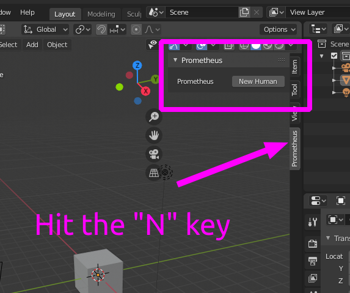

# zpy

Utility bundle for use with bpy. TESTING EXPERIMENTAL.

The current version of zpy is:

```
export ZPY_VERSION="v1.1.8"
```

## Install Blender


Download the latest Blender [here](https://www.blender.org/download/). This code has been tested using Blender version:

```
export BLENDER_VERSION="2.90.1"
export BLENDER_VERSION_SHORT="2.90"
```

## Install pip package

These instructions install the pip package directly in your Blender folder. More information on how [Blender paths work](https://docs.blender.org/manual/en/latest/advanced/blender_directory_layout.html):

**You will have to change these paths depending on your system.**

```
export BLENDER_PATH="/home/ook/Downloads/blender-${BLENDER_VERSION}-linux64/${BLENDER_VERSION_SHORT}"
export BLENDER_LIB_PY="${BLENDER_PATH}/python/lib/python3.7"
export BLENDER_BIN_PY="${BLENDER_PATH}/python/bin/python3.7m"
export BLENDER_BIN_PIP="${BLENDER_PATH}/python/bin/pip3"
```

You might have to install pip itself:

```
${BLENDER_BIN_PY} -m ensurepip && ${BLENDER_BIN_PIP} install --upgrade pip
```

Then install the pip module

```
$BLENDER_BIN_PIP install --extra-index-url=https://74ab8c3212f97d202fdfe59ce6ff9baa2fed10cae3552aee:@packagecloud.io/zumolabs/pypi/pypi/simple zpy-zumo
```

You might have to install more pip packages

```
$BLENDER_BIN_PIP install numpy
$BLENDER_BIN_PIP install gin-config
$BLENDER_BIN_PIP install versioneer
$BLENDER_BIN_PIP install scikit-image
$BLENDER_BIN_PIP install shapely
$BLENDER_BIN_PIP install ptvsd
$BLENDER_BIN_PIP install seaborn
```

OPTIONAL: Export packagecloud pypi as external index url.

```
export PIP_EXTRA_INDEX_URL="https://74ab8c3212f97d202fdfe59ce6ff9baa2fed10cae3552aee:@packagecloud.io/zumolabs/pypi/pypi/simple"
```

## Install Blender Addon

Blender makes it easy to install Addons from a packaged zip file.

Start Blender and navigate to "Edit -> Preferences -> Add-ons". Search and enable "zpy_addon". Save your config.


The add-on will show up in the "N" panel. You can enable the N panel by just pressing "n" on your keyboard.



## Developer Environment Setup

If you are setting up a development environment it will be easier to symlink the zpy pip module directly into the Blender python library. This can be achieved with something like:

```
ln -s ~/zumolabs/zpy/zpy ${BLENDER_LIB_PY}/site-packages/
```

You can also symlink the zpy addon in this way. For linux this is:

```
mkdir -p ~/.config/blender/${BLENDER_VERSION_SHORT}/scripts/addons
ln -s ~/zumolabs/zpy/zpy_addon ~/.config/blender/${BLENDER_VERSION_SHORT}/scripts/addons/zpy_addon
```

## Cutting a Release

Fetch and list existing tags

```
git fetch --tag
git tag
```

Cut a release candidate (e.g. `v1.0.0-rc0`) or release (e.g. `v1.0.0`)

```
cd ~/zumolabs/zpy
git tag ${ZPY_VERSION}-rc0 && \
git push origin ${ZPY_VERSION}-rc0 && \
sleep 5m && \
git tag ${ZPY_VERSION} && \
git push origin ${ZPY_VERSION}
```

Check progress on [CI](https://app.circleci.com/pipelines/github/ZumoLabs/zpy)

Check progress on [packagecloud](https://packagecloud.io/zumolabs/pypi)
