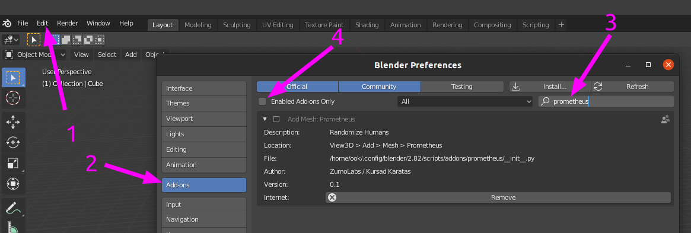

<div align="center">


**`zpy`: Synthetic data in Blender.**

<p align="center">
  <a href="https://zumolabs.ai/">Website</a> •
  <a href="#Install">Install</a> •
  <a href="#Examples">Examples</a> •
  <a href="#Contribute">Contribute</a> •
  <a href="#Licence">Licence</a>
</p>

[](https://pypi.org/project/zpy/)
[](https://badge.fury.io/py/zpy)
[](https://join.slack.com/t/pytorch-lightning/shared_invite/zt-f6bl2l0l-JYMK3tbAgAmGRrlNr00f1A)
[](https://github.com/ZumoLabs/zpy/blob/master/LICENSE)
</div>

## Abstract

Collecting, labeling, and cleaning data for computer vision is a pain. Jump into the future and create your own data instead! This synthetic data is faster to develop with, effectively infinite, and gives you full control to prevent bias and privacy issues from creeping in. We created `zpy` to make synthetic data easy, by piecing together all the different free pieces of code and providing an easy way to generate synthetic data at scale.

## Install

The current version of zpy is:

```
export ZPY_VERSION="v1.1.13"
```

### Install: Blender


Blender is the best free and open 3D creation software in the world! Download the latest Blender [here](https://www.blender.org/download/). This code has been tested using Blender version:

```
export BLENDER_VERSION="2.90"
export BLENDER_VERSION_FULL="2.90.1"
```

### Install: Pip (Python Package)

These instructions install the pip package directly in your Blender folder. More information on how [Blender paths work](https://docs.blender.org/manual/en/latest/advanced/blender_directory_layout.html):

**You will have to change these paths depending on your system.**

```
export BLENDER_PATH="/home/ook/Downloads/blender-${BLENDER_VERSION_FULL}-linux64/${BLENDER_VERSION}"
export BLENDER_LIB_PY="${BLENDER_PATH}/python/lib/python3.7"
export BLENDER_BIN_PY="${BLENDER_PATH}/python/bin/python3.7m"
export BLENDER_BIN_PIP="${BLENDER_PATH}/python/bin/pip3"
```

You might have to install pip itself:

```
${BLENDER_BIN_PY} -m ensurepip && ${BLENDER_BIN_PIP} install --upgrade pip
```

Then install the pip module

```
$BLENDER_BIN_PIP install --extra-index-url=https://74ab8c3212f97d202fdfe59ce6ff9baa2fed10cae3552aee:@packagecloud.io/zumolabs/pypi/pypi/simple zpy-zumo
```

You might have to install more pip packages

```
$BLENDER_BIN_PIP install -r requirements.txt
```

OPTIONAL: Export packagecloud pypi as external index url.

```
export PIP_EXTRA_INDEX_URL="https://74ab8c3212f97d202fdfe59ce6ff9baa2fed10cae3552aee:@packagecloud.io/zumolabs/pypi/pypi/simple"
```

### Install: Blender Addon

Blender makes it easy to install Addons from a packaged zip file.

Start Blender and navigate to "Edit -> Preferences -> Add-ons". Search and enable "zpy_addon". Save your config. The add-on will show up in the "N" panel. You can enable the N panel by just pressing "n" on your keyboard.



### Install: Developer Environment

If you are setting up a development environment it will be easier to symlink the zpy pip module directly into the Blender python library. This can be achieved with something like:

```
ln -s ~/zumolabs/zpy/zpy ${BLENDER_LIB_PY}/site-packages/
```

You can also symlink the zpy addon in this way. For linux this is:

```
mkdir -p ~/.config/blender/${BLENDER_VERSION}/scripts/addons
ln -s ~/zumolabs/zpy/zpy_addon ~/.config/blender/${BLENDER_VERSION}/scripts/addons/zpy_addon
```

Some scenes require the path to the asset library as an environment variable. Example:

```
export ASSETS="~/assets"
```

## Examples

- [Hello World]()
- [Raspberry Pi Component Detection](https://towardsdatascience.com/training-ai-with-cgi-b2fb3ca43929)
- [Vote Counting](https://towardsdatascience.com/patrick-vs-squidward-training-vote-detection-ai-with-synthetic-data-d8e24eca114d)

## Contributing

### Contributing: Community

We welcome community contributions! Join the conversation at our [Slack channel]().

### Contributing: Cutting a Release

Fetch and list existing tags

```
git fetch --tag
git tag
```

Cut a release candidate (e.g. `v1.0.0-rc0`) or release (e.g. `v1.0.0`)

```
git tag ${ZPY_VERSION} && \
git push origin ${ZPY_VERSION}
```
Release Candidates are available to download through pip through explicit version or `pip install --pre zpy`

Check progress on [CI](https://app.circleci.com/pipelines/github/ZumoLabs/zpy)

Check progress on [packagecloud](https://packagecloud.io/zumolabs/pypi)

## Licence

This release of zpy is under the GPLv3 license, a free copyleft license used by Blender.

## BibTeX

If you want to cite these tools:

```bibtex
@article{zpy,
  title={zpy: Synthetic data for Blender.},
  author={Ponte, H. and Ponte, N. and Karatas, K},
  journal={GitHub. Note: https://github.com/ZumoLabs/zpy},
  volume={1},
  year={2020}
}
```